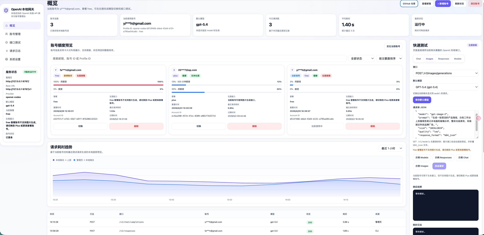
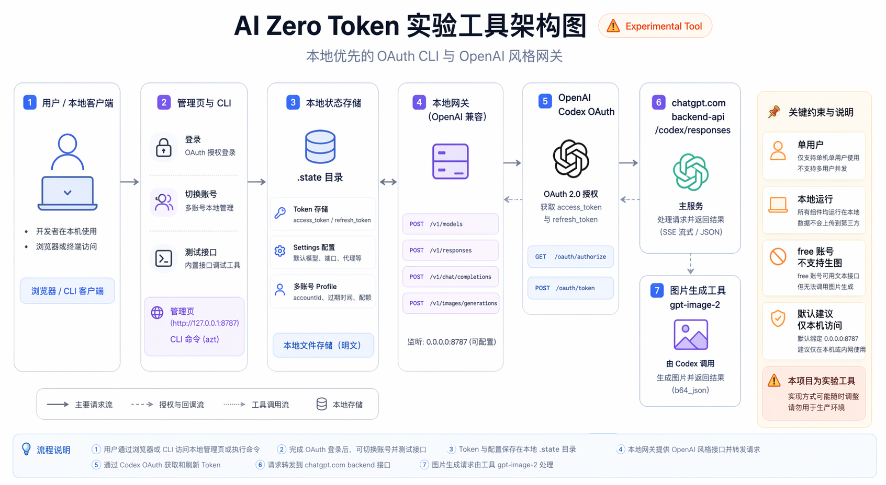

# AI Zero Token

> 实验工具，不建议直接作为生产环境网关使用。

AI Zero Token 是一个本地优先的单用户 AI CLI 和本地网关。

它把账号授权能力整理成 OpenAI 风格接口，重点是把图片生成能力也代理出来：

- `POST /v1/images/generations`
- `POST /v1/responses`
- `POST /v1/chat/completions`
- `GET /v1/models`

很多用户已经有 ChatGPT 之类产品的账号、订阅或可用授权能力，但缺少一个统一、可脚本化、可本地集成的入口。AI Zero Token 要做的，就是把这类已有授权能力整理成一个可直接使用的命令行工具和本地接口。

## 这次迭代亮点

- 直接代理 `gpt-image-2`，把图片生成能力暴露成 OpenAI 风格 `images.generations` 接口
- 启动 `azt start` 后即可获得本地管理页和本地网关，适合脚本、前端和自动化流程接入
- 支持多账号保存、切换当前账号、查看账号套餐 plan，以及当前账号是否支持生图
- 模型列表会优先同步本机 `~/.codex/models_cache.json`，不需要每次为新模型重新 build
- 管理页会每 10 分钟自动同步额度快照和版本状态，并提示当前版本是否可更新
- `free` 账号会在管理页直接预警，并在网关层明确拦截生图请求

如果你只关心一句话，可以把这个项目理解为：

> 一个把账号授权能力代理成本地 OpenAI 风格接口的实验工具，这次重点补齐了 `gpt-image-2` 生图接口。

## 一条命令开始

```bash
npm install -g ai-zero-token
azt start
```

启动后会打开本地管理页，并暴露 OpenAI 风格接口：

```text
http://127.0.0.1:8787/v1
```

## 界面预览



## 生图结果预览

下图通过 AI Zero Token 本地网关调用 `POST /v1/images/generations` 生成，模型为 `gpt-image-2`。


## 为什么做这个项目

如果你只是想在自己的电脑上更低门槛地接入主流 LLM，现实里通常会遇到这几个问题：

- 已经有产品订阅，但还没有开发者 API 方案
- 想把能力接入自己的脚本、前端、本地工作流，但不想每次都手工操作网页
- 想统一本地调用方式，而不是每家产品各写一套接入逻辑
- 想学习 OAuth、CLI、网关、npm CLI、桌面端这类真实工程能力

AI Zero Token 就是围绕这些问题设计的。

## 它能解决什么

- 想把 ChatGPT 的图片生成能力接到自己的前端、小工具或脚本里
- 想先用本地网关验证产品原型，而不是一上来就重做整套后端
- 想统一成 OpenAI 风格接口，减少接入成本
- 想研究一条完整的 OAuth -> token -> 本地状态 -> 网关 -> 上游请求链路

## 架构概览



## 当前能做什么

- 通过 `POST /v1/images/generations` 代理 `gpt-image-2` 生图请求
- 通过 OpenAI Codex OAuth 登录
- 在本地保存 `access_token` 和 `refresh_token`
- 支持保存多个账号 profile，并手动切换当前生效账号
- 在 token 过期时自动刷新
- 通过 `azt start` 一键启动本地 HTTP 网关和管理页面
- 在管理页面里完成多账号登录、查看账号状态、切换当前账号、切换默认模型、测试接口
- 模型列表优先读取本机 Codex 最新缓存，并支持在 CLI / 管理页手动同步
- 暴露 OpenAI 风格接口：
  - `GET /v1/models`
  - `POST /v1/responses`
  - `POST /v1/chat/completions`
  - `POST /v1/images/generations`

## 适合谁用

- 想把账号授权能力包装成本地工具的人
- 想把 `gpt-image-2` 生图接口直接接给脚本、前端或自动化流程的人
- 想做自己的 AI 网关、AI CLI、AI 桌面端的人
- 想学习一条完整 OAuth -> token -> CLI -> HTTP API 链路的人
- 想把 AI 能力接入脚本、前端或自动化流程的人


## 环境要求

- Node.js 22+ 推荐
- Bun 可用于开发和直接运行源码
- 终端网络需要可访问：
  - `https://auth.openai.com`
  - `https://chatgpt.com`

## 安装与运行

### 从源码运行

克隆仓库并安装依赖：

```bash
git clone https://github.com/fchangjun/AI-Zero-Token.git
cd AI-Zero-Token
npm install
```

直接运行源码：

```bash
bun src/cli.ts start
```

### 从 npm 安装 CLI

如果你只是想把它当作本地 CLI 和本地网关使用，可以直接全局安装：

```bash
npm install -g ai-zero-token
```

安装后验证：

```bash
azt start
azt models --refresh
```

如果你是为了开发、构建、`npm link`、`npm pack` 或准备发布，单独看：

- `BUILD_CLI.md`

## 快速开始

启动本地网关和管理页面：

```bash
azt start
```

执行后会自动打开管理页，默认地址：

```text
http://127.0.0.1:8787
```

默认会监听：

```text
0.0.0.0:8787
```

这表示本机可以用 `127.0.0.1:8787` 访问，局域网内其他设备也可以用你的机器 IP 访问，比如 `http://172.26.66.132:8787`。

接下来在管理页里完成这几件事：

- 登录一个或多个 OpenAI Codex 账号
- 查看当前账号状态和过期时间
- 在已保存账号之间切换当前使用账号
- 切换默认模型
- 直接测试 `models`、`responses`、`chat.completions`
- 直接测试 `images.generations` 生图接口

如果你要把它接到自己的客户端，只需要把 Base URL 指向：

```text
http://127.0.0.1:8787/v1
```

Vibe Coding、OpenAI-compatible SDK 和脚本接入可以参考：

- [API 使用说明](docs/API_USAGE.md)

如果你要让本地网页直接从浏览器请求这个网关，现在已经默认开启 CORS。

如需限制来源，可以在启动前指定：

```bash
AZT_CORS_ORIGIN=http://127.0.0.1:8124 azt start
```

多个来源可用英文逗号分隔：

```bash
AZT_CORS_ORIGIN=http://127.0.0.1:8124,http://localhost:3000 azt start
```

如果你当前还没有全局命令，也可以把上面的 `azt` 临时替换成：

```bash
bun src/cli.ts
```

例如：`bun src/cli.ts start`

## 网关使用说明

如果你主要把 AI Zero Token 当作本地网关来使用，推荐只记住一个命令：

### 1. 启动

```bash
azt start
```

启动后会自动打开管理页。管理页就是默认工作入口，你可以在里面直接：

- 触发 OpenAI Codex OAuth 登录并新增账号
- 查看当前账号、已保存账号列表、过期时间、token 摘要
- 查看账号套餐 plan 和当前账号是否支持生图
- 在多个已保存账号之间切换当前使用账号
- 在“新增账号”里选择 OAuth 登录，或粘贴外部账号 JSON 批量导入
- 导出单个账号，或勾选多个账号后批量导出所选账号 JSON
- 删除单个本地账号，或一键清空全部本地账号
- 切换默认模型
- 测试 `models` / `responses` / `chat.completions`
- 测试 `images.generations`

管理页里邮箱默认脱敏显示，需要手动点击“查看邮箱”才会显示明文。

导出的账号 JSON 包含完整 `access_token` 和 `refresh_token`，等同于账号登录凭据，只适合在可信环境中传递。

如果当前网络访问海外上游不稳定，可以在管理页的“接口测试 / 系统设置”区域启用“上游代理”，并填写你自己的代理地址。保存后，OAuth 换取 token、模型刷新和接口转发都会通过该代理访问上游；本地管理页和 `127.0.0.1` 默认保持直连。

默认监听地址：

```text
http://0.0.0.0:8787
```

本机浏览器访问：

```text
http://127.0.0.1:8787
```

默认 CORS 来源：

```text
*
```

### 2. 把它接到你的客户端

客户端或 SDK 里把 Base URL 改成：

```text
http://127.0.0.1:8787/v1
```

如果客户端必须填写 API Key，可以填任意非空占位值；真正起作用的是本地网关地址。

### 3. 查看模型列表

OpenAI 风格模型接口：

```bash
curl http://127.0.0.1:8787/v1/models
```

### 4. 调用对话接口

最小请求示例：

```bash
curl http://127.0.0.1:8787/v1/responses \
  -H "content-type: application/json" \
  -d '{"model":"gpt-5.4","input":"请只回复 OK"}'
```

带 `instructions` 的请求示例：

```bash
curl http://127.0.0.1:8787/v1/responses \
  -H "content-type: application/json" \
  -d '{"model":"gpt-5.4","instructions":"你是一个简洁助手","input":"请只回复 OK"}'
```

兼容 `chat.completions` 的最小请求示例：

```bash
curl http://127.0.0.1:8787/v1/chat/completions \
  -H "content-type: application/json" \
  -d '{
    "model": "gpt-5.4",
    "messages": [
      {
        "role": "user",
        "content": "请只回复 OK"
      }
    ]
  }'
```

### 5. 调用生图接口

OpenAI 风格 `images.generations` 示例：

```bash
curl http://127.0.0.1:8787/v1/images/generations \
  -H "content-type: application/json" \
  -d '{
    "model": "gpt-image-2",
    "prompt": "生成一张白底红苹果商品图，构图简洁，光线干净。",
    "size": "1024x1024",
    "quality": "low",
    "response_format": "b64_json"
  }'
```

响应会返回 OpenAI 同类型结构的 `data[].b64_json`。如果你在管理页里测试，这张图片会直接显示预览。
如果请求里不显式传 `model`，当前默认会使用 `gpt-image-2`。

生图能力和账号套餐有关：

- `plus` 或更高套餐账号可正常调用 `images.generations`
- `free` 账号不支持生图，网关会直接返回明确错误，而不是继续请求上游
- 管理页会显示当前账号的 `plan` 和“生图能力”状态
- 当当前账号是 `free` 且你选中 `Images` 测试时，“发送请求”按钮会被直接禁用

### 6. 当前支持的接口

- `GET /_gateway/health`
- `GET /_gateway/status`
- `GET /_gateway/models`
- `POST /_gateway/models/refresh`
- `GET /_gateway/admin/config`
- `POST /_gateway/admin/login`
- `POST /_gateway/admin/logout`
- `POST /_gateway/admin/profiles/activate`
- `POST /_gateway/admin/profiles/remove`
- `PUT /_gateway/admin/settings`
- `GET /v1/models`
- `POST /v1/responses`
- `POST /v1/chat/completions`
- `POST /v1/images/generations`

### 7. 当前支持的主要参数

`POST /v1/responses` 当前主要支持：

- `model`
- `input`
- `instructions`
- `stream`
- `tools`
- `tool_choice`
- `include`
- `text`
- `store`
- `parallel_tool_calls`
- `experimental_codex.body`
- `experimental_codex.allow_unknown_model`
- `experimental_codex.include_raw`

`POST /v1/chat/completions` 当前主要支持：

- `model`
- `messages`
- `tools`
- `tool_choice`
- `response_format`
- `temperature`
- `top_p`
- `presence_penalty`
- `frequency_penalty`
- `metadata`
- `stop`
- `store`
- `parallel_tool_calls`

`POST /v1/images/generations` 当前主要支持：

- `prompt`
- `model`
- `n`
- `size`
- `quality`
- `background`
- `output_format`
- `output_compression`
- `moderation`
- `response_format`
- `user`

### 8. 当前限制

- `stream=true` 目前只识别，不返回真实流式结果
- 还没有完整覆盖 OpenAI Responses API 的全部字段
- `chat.completions` 暂不支持 `n > 1`
- `images.generations` 暂不支持 `n > 1`
- `images.generations` 当前只返回 `b64_json`，暂不支持托管图片 `url`
- `images.generations` 当前只透传 GPT Image 路径，不兼容 DALL·E 专有参数
- `images.generations` 对账号套餐有要求；`free` 账号会被网关直接拦截并返回“不支持图片生成”
- 网关当前默认面向本地单用户使用

## 兼容说明

代码里仍然保留了 `login`、`status`、`models`、`profiles`、`ask`、`serve`、`clear` 等 CLI 命令，主要用于调试、兼容和后续扩展。

账号 JSON 也可以通过 CLI 导入/导出：

```bash
azt profiles import ./profile.json
azt profiles export active ./profile.json
azt profiles export all ./profiles.json
azt profiles export "openai-codex:<accountId>" ./profile.json
```

README 不再把这些命令作为推荐使用方式。默认使用路径就是：

```bash
azt start
```

## 交流与反馈

如果你在使用过程中遇到安装问题、账号切换问题、生图异常，或者想交流自己的接入场景，可以通过下面两种方式联系我：

- GitHub Issues: [https://github.com/fchangjun/AI-Zero-Token/issues](https://github.com/fchangjun/AI-Zero-Token/issues)
- 微信交流：先加我微信，备注 `AI Zero Token`，我会再拉你进交流群

如果你已经把二维码放到仓库里，可以直接查看：


## 本地状态

项目会在仓库目录下写入：

- `.state/store.json`
- `.state/settings.json`

它们分别用于保存：

- OAuth 认证信息和多个本地账号 profile
- 默认模型和服务配置

## 项目结构

- `src/cli/`
  CLI 命令解析和命令分发
- `src/core/`
  核心业务逻辑
- `src/core/services/`
  认证、模型、聊天、配置服务
- `src/core/store/`
  本地状态读写
- `src/core/providers/openai-codex/`
  OpenAI Codex provider 实现
- `src/server/`
  本地 HTTP 网关
