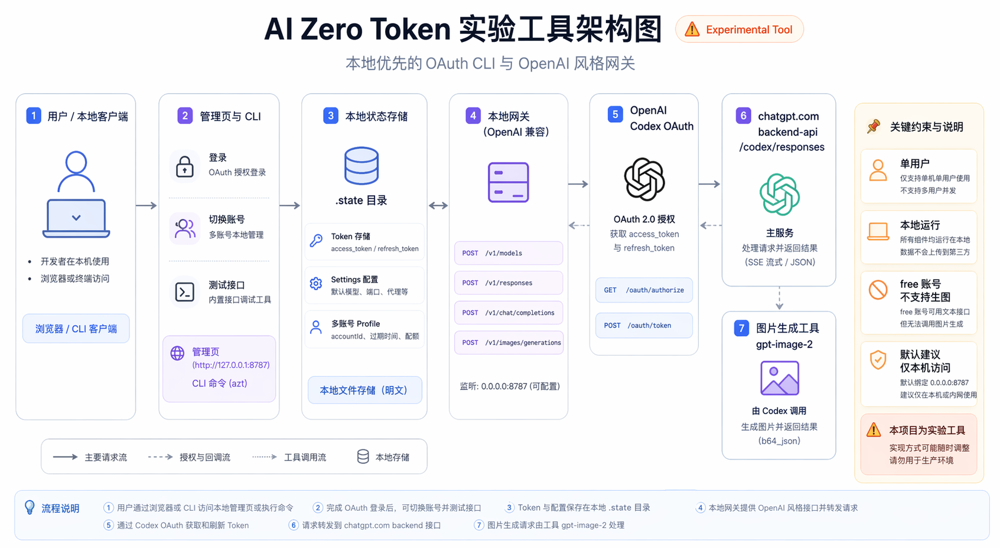

# AI Zero Token

[English](README.md) | [简体中文](README.zh-CN.md)

AI Zero Token 是一个本地优先的 OpenAI 兼容网关，用于把 ChatGPT/Codex OAuth 账号能力包装成本地 CLI、管理页和 HTTP API。

它适合本地单用户场景、原型验证、自动化脚本和 OpenAI-compatible 客户端接入。

> 这是实验性质的本地工具，不是 OpenAI 官方产品，也不建议作为生产级多租户网关使用。

> 第一次使用？请先阅读配有真实界面截图的 [中文使用指南](docs/GETTING_STARTED.zh-CN.md)。

## 功能

- OpenAI 风格本地接口：
  - `GET /v1/models`
  - `POST /v1/responses`
  - `POST /v1/chat/completions`
  - `POST /v1/images/generations`
  - `POST /v1/images/edits`
- 支持 ChatGPT/Codex OAuth 登录和本地 token 自动刷新。
- 管理页支持多账号保存、切换和删除。
- 支持账号 JSON 导入/导出、ZIP 批量导入、复选框批量导出和导出记录提示。
- 支持把已保存账号应用到本机 Codex，并自动备份 `~/.codex/auth.json`。
- 支持 `gpt-image-2` 文生图和 JSON 图生图；付费账号继续使用 Codex Responses 图片工具，Free 账号可在设置里选择是否启用 ChatGPT 网页图片链路。
- 支持 API 账号额度耗尽后自动切换到下一个账号，包括尚未同步额度的新账号，并可配置全局额度刷新并发数。
- 支持上游代理配置，覆盖 OAuth、模型刷新和接口转发。
- 模型列表优先读取本机 Codex 模型缓存，并支持手动从 Codex 后端同步。
- 面向 OpenClaw 增强 Chat Completions 兼容，支持流式、工具调用、工具结果消息和请求日志诊断。
- 支持本地持久化用量统计，记录已知 token、图片数、成功/失败、耗时，以及账号/模型/接口维度汇总。

## 技术架构



AI Zero Token 会把账号 token、网关配置和运行状态保存在本地，通过 OpenAI 兼容接口转发到当前选中的 ChatGPT/Codex OAuth 账号。管理页读取同一份本地状态，因此账号切换、应用到 Codex、代理配置和额度耗尽自动切换都可以在本地统一管理。

## 快速开始

```bash
npm install -g ai-zero-token
azt start
```

启动后会打开本地管理页，并暴露本地网关：

```text
http://127.0.0.1:8787
http://127.0.0.1:8787/v1
```

默认沿用免密调用，客户端要求 API Key 时可填 `local`。在“模型与服务 → 对外提供 API → 服务概览”启用访问密钥后，所有模型接口都需要 `Authorization: Bearer <访问密钥>`。

## 桌面端预览

当前仓库已提供 Electron 桌面端预览入口。它会在桌面主进程中启动现有本地网关，并直接加载当前管理页：

```bash
npm run desktop
```

构建桌面端发布包：

```bash
npm run dist:mac
npm run dist:win
```

发布说明见 [docs/DESKTOP_RELEASE.md](docs/DESKTOP_RELEASE.md)。
桌面端安装包会在每次打标签发布后上传到 GitHub Releases：

- [GitHub Releases](https://github.com/fchangjun/AI-Zero-Token/releases)

桌面端第一版沿用现有默认监听策略：

```text
0.0.0.0:8787
```

本机客户端仍建议使用：

```text
http://127.0.0.1:8787/v1
```

macOS 桌面端还会常驻菜单栏，提供快速账号面板。可以从菜单栏切换网关账号、把账号应用到本机 Codex、刷新额度、复制 API Base URL 和重启本地网关。

## 管理页

管理页是推荐入口，可以完成：

- OpenAI Codex OAuth 登录。
- 导入一个或多个账号 JSON，或校验并导入包含多个账号 JSON 的 ZIP 压缩包。
- 切换当前账号。
- 导出单个账号或勾选导出多个账号，并在账号卡片上显示导出状态。
- 勾选后批量删除账号。
- 将已保存账号应用到本机 Codex。
- 配置默认文本模型和上游代理。
- 开启当前 API 账号额度耗尽后的自动切换，并配置不参与自动轮换的账号名单。
- 为账号池较多的场景调整全局额度刷新并发数。
- 测试 `models`、`responses`、`chat.completions`、`images.generations`、`images.edits`。
- 查看今日、本次启动和历史累计的本地用量统计。
- 独立检查两个发布通道：桌面端只与 GitHub Releases 的同平台桌面构建比较，npm/CLI 只与 npm registry 比较；本地桌面版本更高时明确显示为“开发版 / 未发布”，不会误报更新。


## API 使用

### 模型列表

```bash
curl http://127.0.0.1:8787/v1/models
```

### Responses

```bash
curl http://127.0.0.1:8787/v1/responses \
  -H "content-type: application/json" \
  -d '{"model":"gpt-6-luna","input":"请只回复 OK"}'
```

### Chat Completions

```bash
curl http://127.0.0.1:8787/v1/chat/completions \
  -H "content-type: application/json" \
  -d '{
    "model": "gpt-6-luna",
    "messages": [
      {
        "role": "user",
        "content": "请只回复 OK"
      }
    ]
  }'
```

OpenClaw 或其他 OpenAI 兼容编程客户端可以这样配置：

```text
Provider: OpenAI compatible
Base URL: http://127.0.0.1:8787/v1
API Key: local
Model: gpt-6-luna
Streaming: enabled
Tools / function calling: enabled
```

`/v1/chat/completions` 支持 `stream=true`、`tools`、`tool_choice`、`parallel_tool_calls`、assistant `tool_calls`、tool role 结果消息和 `reasoning_effort`。OpenClaw 请求也会在管理页请求日志里显示，并只保存安全摘要。

Codex CLI/Desktop 也可以把本工具配置成自定义 Responses provider：

“模型与服务”分为“接入外部 API”和“对外提供 API”。账号管理、模型目录、默认模型、Free 账号生图和轮换策略统一位于“对外提供 API”，沿用现有账号文件；旧 `#accounts` 链接自动跳转到账号池。

在“对外提供 API → 服务概览”复制本机或局域网调用配置，也可以一键接入本机 Codex。API 服务状态与 Codex 接入状态分别显示：Codex 切到外部 API 或解除接入时，账号池服务继续运行。连接其他设备的 AI Zero Token 网关，请使用“接入外部 API → 接入远程 AI Zero Token”。

访问密钥是可选功能。启用、更换和关闭即时生效，密钥以 `0600` 权限保存；启用时模型接口验证 Bearer 密钥。无论是否启用访问密钥，管理接口始终仅限本机操作，局域网客户端仅调用模型 API。已接入本机网关的 Codex 配置会同步更新为 `azt_gateway`，重启 Codex 后生效；其他客户端需要更新密钥。外部 API 和远程网关的 Codex 配置保持独立。

免密模式下可在“高级设置 · 历史兼容”选择原生 `openai` 或独立 `AI Zero Token`。也可手动写入 `~/.codex/config.toml`：

公司中转和其他 OpenAI 兼容 API 现在通过独立的“模型与服务”页面管理。选择“接入外部 API → 添加外部 API”，填写名称、Base URL 和 Token，自动读取 `/models` 返回的全部模型；没有模型列表接口时可手动填写模型 ID。保存服务不会改变 Codex 的当前接入。

在服务详情页可以单独或批量检测 Responses 流式输出、工具调用、工具结果、推理档位和图片输入。检测使用真实请求，会消耗上游额度；离开页面后后台检测仍会继续。暂时繁忙或网络失败会保留上次成功确认的能力，并标记结果来源。

点击“接入 Codex”，勾选要显示的模型并选择默认模型。未检测、繁忙或不兼容的模型都可勾选，标签只提供参考。系统会写入该服务及所选模型的目录；同一时间只启用一个服务，重启 Codex 后生效。编辑服务后需要重新保存 Codex 接入配置，旧版外部 API 设置和检测历史会自动导入。切换服务会保留旧服务记录，删除服务会清除其配置；继续旧对话可能仍依赖原服务。

```toml
model = "gpt-6-luna"
model_provider = "openai"
openai_base_url = "http://127.0.0.1:8787/codex/v1"
```

这里继续使用 Codex 原生 `openai` provider 标识，只替换 `openai_base_url`，因此本地历史记录仍会留在同一个 Codex 历史视图里。

如果想让 Codex 显示独立的 `AI Zero Token` provider，就在“服务概览 → 本机 Codex 接入 → 高级设置”切换模式。那会写入 `[model_providers.ai-zero-token]`，而不是 `openai_base_url`。

当 Codex 请求里包含 `image_generation` 工具时，Plus、Team、Pro 等付费账号继续透传到 Codex Responses 图片工具；如果在“对外提供 API → 可用模型”开启“Free 账号生图”，Free 账号会改走 ChatGPT 网页图片链路，并包装成 Codex Responses SSE 返回。这个分流解决的是上游服务差异：Free 账号可以有 ChatGPT 图片额度，但不一定拥有 Codex `image_generation` tool。

### 文生图

```bash
curl http://127.0.0.1:8787/v1/images/generations \
  -H "content-type: application/json" \
  -d '{
    "model": "gpt-image-2",
    "prompt": "生成一张白底红苹果商品图，构图简洁，光线干净。",
    "size": "1024x1024",
    "quality": "low",
    "response_format": "b64_json"
  }'
```

响应会返回 OpenAI 风格的 `data[].b64_json`。


### 图生图

`/v1/images/edits` 当前支持 JSON 请求，图片可以使用 URL、data URL 或裸 base64：

```bash
curl http://127.0.0.1:8787/v1/images/edits \
  -H "content-type: application/json" \
  -d '{
    "model": "gpt-image-2",
    "prompt": "参考这张图，生成一张更适合科技产品广告的版本。",
    "images": [
      {
        "image_url": "data:image/png;base64,替换为你的图片base64"
      }
    ],
    "size": "1024x1024",
    "quality": "low",
    "response_format": "b64_json"
  }'
```

更多示例见 [docs/API_USAGE.md](docs/API_USAGE.md)。

## 账号管理

AI Zero Token 的账号状态默认保存在：

```text
~/.ai-zero-token/.state
```

管理页支持：

- OAuth 登录。
- 从单个 profile、数组或 `profiles` bundle 导入。
- 从包含多个账号 JSON 的 ZIP 压缩包批量导入，导入前会先校验。
- 导出单个账号。
- 使用复选框批量导出已选择账号。
- 显示导出记录，包括导出次数、最近导出时间和导出方式。
- 删除单个账号或批量删除已选择账号。
- 切换当前账号。

导出的账号 JSON 包含认证 token，等同于登录凭据，只应在可信环境中使用。

### 应用到 Codex

`应用到 Codex` 会把选中的账号写入：

```text
~/.codex/auth.json
```

写入前会把原文件备份为 `auth.json.azt-backup-*`。新的 Codex 会话会使用该账号。

## 配置

默认监听：

```text
0.0.0.0:8787
```

本地网关 Base URL：

```text
http://127.0.0.1:8787/v1
```

限制浏览器 CORS 来源：

```bash
AZT_CORS_ORIGIN=http://127.0.0.1:8124 azt start
```

多个来源用英文逗号分隔：

```bash
AZT_CORS_ORIGIN=http://127.0.0.1:8124,http://localhost:3000 azt start
```

覆盖持久化状态目录：

```bash
AI_ZERO_TOKEN_HOME=/path/to/home azt start
```

管理页里的配置会保存在同一个本地状态目录。额度耗尽自动切换会保存为 `autoSwitch.enabled`；开启后，网关会根据最近一次保存的额度快照判断当前 API 账号是否耗尽，并把 API 流量切到下一个仍有额度的账号。`autoSwitch.excludedProfileIds` 里的账号不参与自动轮换，但仍可手动应用。

全局额度刷新并发数可以在“对外提供 API → 轮换策略”调整，默认 `3`。账号很多时可以调高；遇到上游限流或失败增多时建议调低。

默认请求体上限是 `128 MiB`，用于让 JSON base64 图片和 Codex 上下文压缩请求在本地场景里更实用；`/codex/v1/responses/compact` 专用路由会至少放宽到 `256 MiB`。可以用下面的环境变量覆盖：

```bash
AZT_BODY_LIMIT_MB=256 azt start
```

## 生图额度

ChatGPT Images 的可用性和额度由上游账号决定。Plus、Team、Pro 等付费账号走 Codex Responses 的 `image_generation` tool。Free 账号只有在“对外提供 API → 可用模型”开启“Free 账号生图”时才走 ChatGPT 网页图片链路；关闭时继续走原先 Codex 图片工具链路。Free 账号限制比付费账号更严格，官方没有公开固定张数；如果网页链路也耗尽额度，网关会展示上游真实返回。

付费账号图片请求内部使用 `gpt-5.4-mini` 作为编排模型，并把请求里的图片模型（例如 `gpt-image-2`）传给 `image_generation` tool；开启“Free 账号生图”后，Free 账号会把同样的请求转换为 ChatGPT 网页图片任务。

对于 JSON 图生图，base64 通常比原始图片大约 33%。在默认 `128 MiB` 请求体上限下，原始图片约 `96 MiB` 是比较实际的上限，再大就容易被 JSON 开销和本地内存影响。大图或批量场景建议优先使用可访问的图片 URL。

## 当前限制

- 项目默认面向本地单用户使用。
- `/v1/chat/completions` 已支持 OpenAI 风格 SSE 流式；Codex 自定义 provider 使用 `/codex/v1/responses` 和 `/codex/v1/responses/compact` 专用路由做上游 Responses SSE 透传。
- `/v1/chat/completions` 支持常见工具/函数调用字段，但暂不支持 `n > 1`。
- `/v1/images/generations` 当前返回 `b64_json`，暂不支持托管图片 URL。
- `/v1/images/generations` 暂不支持 `n > 1`。
- `/v1/images/edits` 当前只支持 JSON，暂不支持 `multipart/form-data`、`mask` 和 `file_id`。
- 超大的 base64 JSON 请求受 `AZT_BODY_LIMIT_MB` 和本地内存限制。
- OpenAI Responses API 兼容范围是常见本地客户端工作流，不是完整实现。

## 安全

- `access_token`、`refresh_token`、`id_token` 都等同于登录凭据。
- 不要把本地网关暴露给不可信网络。
- 不要在不可信环境中传递导出的账号 JSON。
- 复制或发布本地文件前，请检查 `~/.ai-zero-token/.state` 和 `~/.codex/auth.json`。

## 开发

安装依赖：

```bash
npm install
```

源码运行：

```bash
bun src/cli.ts start
```

验证：

```bash
npm run typecheck
npm run build
```

CLI 构建和发布说明见 [BUILD_CLI.md](BUILD_CLI.md)。用户可见变更见 [CHANGELOG.md](CHANGELOG.md)。

## 项目状态

AI Zero Token 仍在快速迭代。当前重点是稳定本地网关、账号迁移工作流，以及 OpenAI 风格客户端的图片生成/编辑兼容性。

反馈和问题：[GitHub Issues](https://github.com/fchangjun/AI-Zero-Token/issues)
