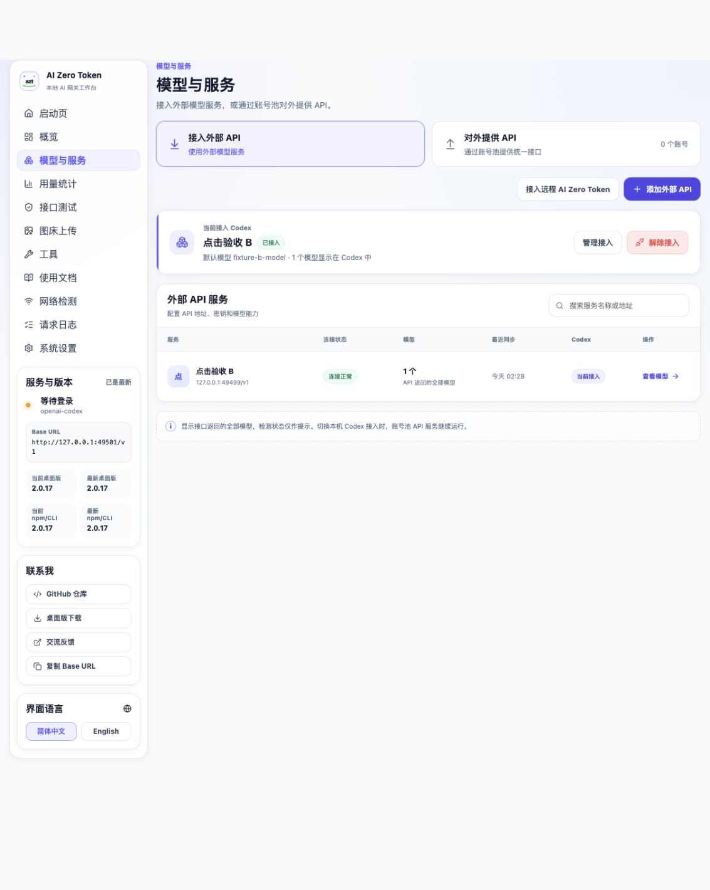
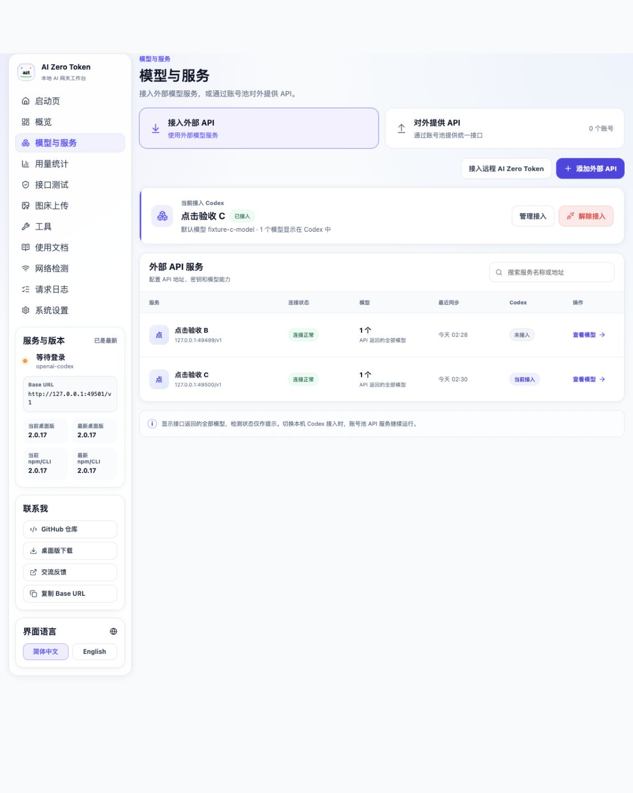
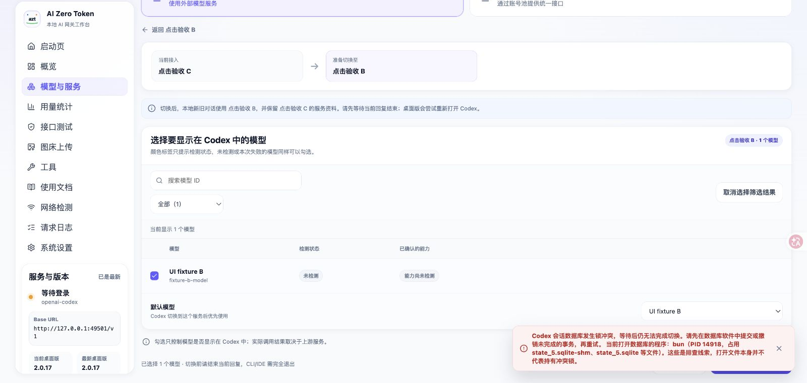
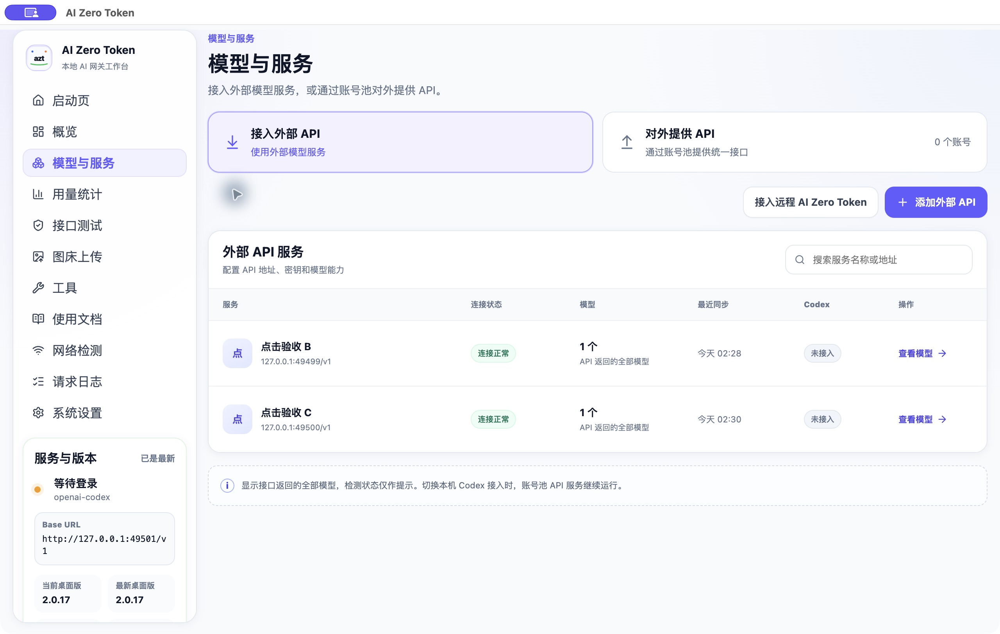

# Codex 服务切换：界面操作验收

日期：2026-09-30。

## 环境与范围

使用工作区最新构建的产品页面及实际服务端切换实现，沿界面新增服务、选择模型、接管、切换、解除接管。操作由浏览器控件和 macOS 窗口控件完成，没有用接口调用代替这些操作。

- 使用独立 `CODEX_HOME`、AZT 状态目录和合成凭据；B、C 的上游是两个本地模拟 API。
- 数据库包含普通会话和归档会话，包含旧 provider 引用；JSONL 中保留一条历史未完成事件。
- 数据库查看器场景由独立 SQLite 进程保持连接或事务复现。没有改写用户在 DB Browser 中打开的真实数据库。
- 浏览器确认框自动化出现超时后，在独立 Electron 41.3.0 窗口加载相同页面，完成原生确认框的取消和确认测试。
- 该窗口只承载产品页面。正在承载当前对话的 Codex 的退出、重开没有执行，不能算作已经通过的桌面重启验收。真实第三方服务和账单扣费也不在本次范围内。

## 操作与结果

| 界面操作 | 条件 | 结果 |
| --- | --- | --- |
| 添加外部 API → 填写 B → 保存并获取模型 | 另一个进程保持数据库连接 | B 创建成功，模型列表来自 B；原生会话设置尚未切换 |
| 接入 Codex → 接入 B | 保持数据库连接 | 页面显示 B 已接入；普通和归档会话均使用 `azt_active`、`fixture-b-model`，地址为 B |
| 添加 C → 接入 Codex → 确认切换到 C | 保持 WAL 读事务 | 页面当前接入方变为 C；两条会话模型及地址切到 C；B 的服务资料保留 |
| B → 接入 Codex → 确认切换到 B | 另一个进程持有未提交写事务 | 等待后返回锁冲突；没有显示 B 接管成功；失败恢复后配置、会话和活动服务均保持 C |
| 关闭错误提示 → 原页面再次确认切换 B | 释放写锁，保留读取连接 | 重试成功，两条会话及连接配置切回 B |
| 解除接入 → Cancel | 保持读取连接 | 页面仍显示 B 接管，配置和会话字段未变 |
| 解除接入 → OK | 保持读取连接 | 两条会话均恢复 `openai`、`native-fixture`、`high`；活动服务清空，活动配置中第三方 Key 被移除 |

各阶段核对 JSONL 和 `auth.json` 哈希均保持不变。最终没有未完成切换的 pending 文件。B、C 的资料和测试 Key 仍保存在 AZT 的服务记录中；`azt_active` 的兼容定义保留，但不再是活动 provider。

## 界面测试发现并修复的问题

错误提示原先与成功提示一样，4 秒后自动消失。真实锁冲突信息包含程序名、PID 和处理方式，容易在用户读完前消失。

现已让错误提示持续保留，增加“关闭错误提示”按钮；开始重试时清理上一条提示。成功提示仍按原方式自动消失。界面中已验证保留提示、手动关闭及重新切换；UI 类型检查和构建通过。

## 截图

### B 已接管

### C 已接管

### 真实写锁冲突

### 解除后恢复原生

## 重复测试

1. `npm run build`。
2. `bun scripts/verify-codex-switch-ui.ts`。
3. 打开输出中的 `url`，通过界面完成上述操作。也可用本项目的 Electron 启动输出中的 `desktopEntry`。
4. 在脚本终端输入 `idle`、`read`、`write` 控制独立 SQLite 连接，输入 `snapshot` 保存和输出当前设置证据。
5. 输入 `quit` 结束测试服务及数据库连接。临时目录保留供检查；界面操作不会修改真实用户的 Codex 数据。

## 后续回归：桌面启动环境丢失

上面的界面验收没有经过 `desktop:dev` 启动链路，遗漏了该入口的环境变量传递问题。用户随后报告“无法检查 Codex 运行进程，未执行切换。请确认 lsof 可用”。

已复现：`scripts/dev.mjs` 先合并环境变量，随后又用 `...options` 中的 `env` 覆盖合并结果，导致 Electron 丢失 `PATH` 等继承变量。macOS 的 `lsof` 位于 `/usr/sbin/lsof`；通过命令名调用时返回 `ENOENT`。系统工具本身存在且可正常运行。

修复启动器的合并顺序，并在 macOS 直接使用 `/usr/sbin/lsof` 和 `/bin/ps`；检查失败时区分找不到命令、权限、输出容量及超时。

- 启动器回归执行实际启动脚本，以记录器替代子进程启动，核对 web、desktop 两个入口保留 `PATH`、`HOME`、`CODEX_HOME` 和 `AI_ZERO_TOKEN_HOME`。
- 新增两个真实进程检查用例：`PATH` 未设置、`PATH=/usr/bin:/bin`。修复前均复现同一报错，修复后均通过。
- 使用 Electron 41.3.0 的 Node 运行模式运行构建产物，在上述两种环境下均能找到测试文件句柄，并允许普通数据库读取连接；未启动或关闭用户的 Codex。
- 35 项相关回归通过，构建通过。当时完整类型检查受并行开发的 `src/desktop/update-fetch.ts` 中 `Headers` 类型错误影响；2.0.18 发布检查已将该处改为逐项构建请求头，并重新通过完整类型检查。

已运行的 `desktop:dev` 后端只在启动时载入构建产物，需要重启该开发进程才能使用修复，刷新页面不会更新后端。
