# AI Zero Token 中文使用指南

> 面向第一次使用 AI Zero Token 的用户，内容以当前桌面客户端、CLI、管理界面和接口实现为准。

AI Zero Token 是一个本地优先的 OpenAI 兼容网关。它可以把 ChatGPT/Codex OAuth 账号池统一提供给 Codex、OpenClaw 和其他 OpenAI 兼容客户端，也可以把 OneAPI、OpenRouter 或自建兼容服务接入本机 Codex。它还包含接口测试、图床、统计、日志和网络诊断等辅助工具。

> AI Zero Token 不是 OpenAI 官方产品，适合本地单用户使用，不建议作为生产级多租户网关。

## 快速导航

| 功能 | 适合解决什么问题 | 入口 |
| --- | --- | --- |
| [对外提供 API](#1-对外提供-api) | 把 OAuth 账号池变成统一的 OpenAI 兼容 API | `模型与服务 → 对外提供 API` |
| [接入外部 API](#2-接入外部-api) | 把第三方或自建兼容服务接入 Codex | `模型与服务 → 接入外部 API` |
| [图床上传](#3-图床上传) | 把本地图片上传到 GitHub 并获取公网链接 | `图床上传` |
| [接口测试](#4-接口测试) | 在客户端内验证模型、对话、Responses 和图片接口 | `接口测试` |
| [用量统计](#5-用量统计) | 查看请求量、token、费用、图片和失败情况 | `用量统计` |
| [请求日志](#6-请求日志) | 按接口、模型、账号和状态排查请求 | `请求日志` |
| [网络检测](#7-网络检测) | 检查出口、DNS、代理、WebRTC 和平台连通性 | `网络检测` |
| [使用文档](#8-客户端内置使用文档) | 复制当前网关参数和示例代码 | `使用文档` |
| [系统设置](#9-系统设置) | 管理代理、诊断记录和邮箱脱敏 | `系统设置` |
| [Response Reviewer](#10-response-reviewer) | 审阅具体回复、添加批注并整理修改意见 | `工具` |
| [桌面更新](#桌面更新) | 查看发布说明、下载并重启安装 | 左侧更新入口 |

## 安装并打开桌面客户端

普通用户从 [GitHub Releases](https://github.com/fchangjun/AI-Zero-Token/releases) 下载桌面端：

| 系统 | 下载文件 |
| --- | --- |
| Apple Silicon Mac（M1/M2/M3/M4） | `AI Zero Token-{version}-mac-arm64.dmg` |
| Intel Mac | `AI Zero Token-{version}-mac-x64.dmg` |
| Windows 安装版 | `AI Zero Token Setup {version}.exe` |
| Windows 便携版 | `AI Zero Token-{version}-win.zip` |

macOS 当前发布包使用 ad-hoc 签名，尚未使用 Apple Developer ID 公证。如果系统把浏览器下载的 DMG 提示为“已损坏”或阻止打开，请先阅读 DMG 内的 `mac-install-guide.txt`，不要从非官方来源下载程序。

打开客户端后，先看左侧“服务与版本”区域：显示“服务运行中”就表示本地网关已经启动。实际端口以客户端里的 Base URL 为准，不一定与截图一致。

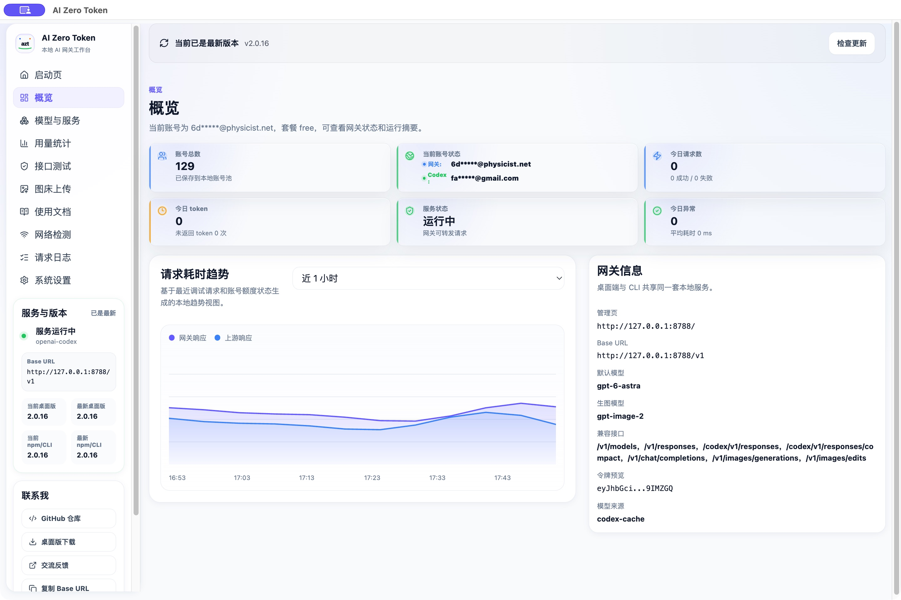

**成功标志：** 左侧显示“服务运行中”，并能看到形如 `http://127.0.0.1:端口/v1` 的 Base URL。

### 桌面更新

macOS 桌面版会检查 GitHub 正式发布。发现新版后，可从左侧更新入口、页面提示或系统通知打开详情，查看版本、发布时间、下载大小和升级记录。

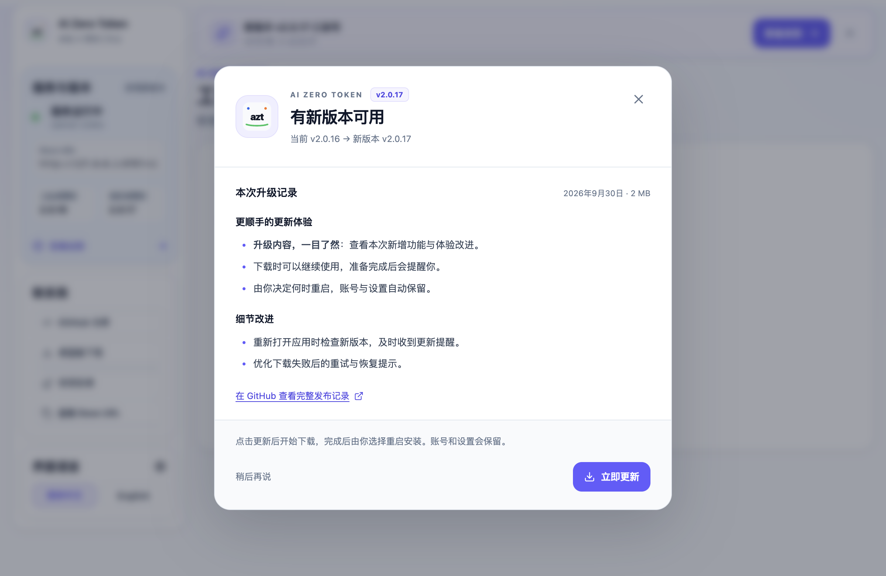

点击“立即更新”开始下载；下载与准备期间可以继续使用，也可以取消下载。准备完成后由你确认重启安装，不会直接打断当前工作。点击“稍后再说”会暂缓当前版本的提示，仍可从侧栏再次打开。返回应用时，距离上次检查超过五分钟会重新检查；网络失败时可手动重试。

更新会验证官方安装包的校验值、版本和架构。无法自动更新时按页面提示前往 GitHub 手动下载安装；Windows 当前使用手动下载安装方式。npm/CLI 独立使用 `npm install -g ai-zero-token` 更新。

## 1. 对外提供 API

### 功能用途与适用场景

“对外提供 API”会把已添加的 ChatGPT/Codex OAuth 账号组成账号池，对本机或局域网提供统一接口。适合：

- 让 Codex、OpenClaw、脚本或其他 OpenAI 兼容客户端使用同一个本地地址；
- 多个账号之间按可用状态自动轮换；
- 集中查看账号额度、可用模型、调用统计和请求日志。

### 1.1 添加账号

进入 `模型与服务 → 对外提供 API → 账号池`，点击“新增账号”。

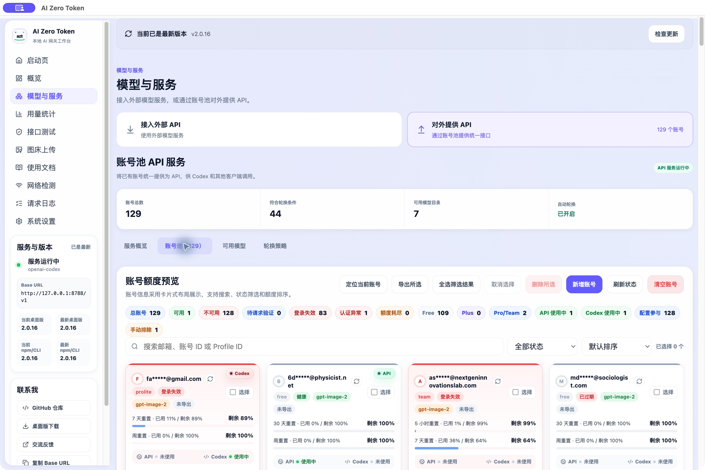

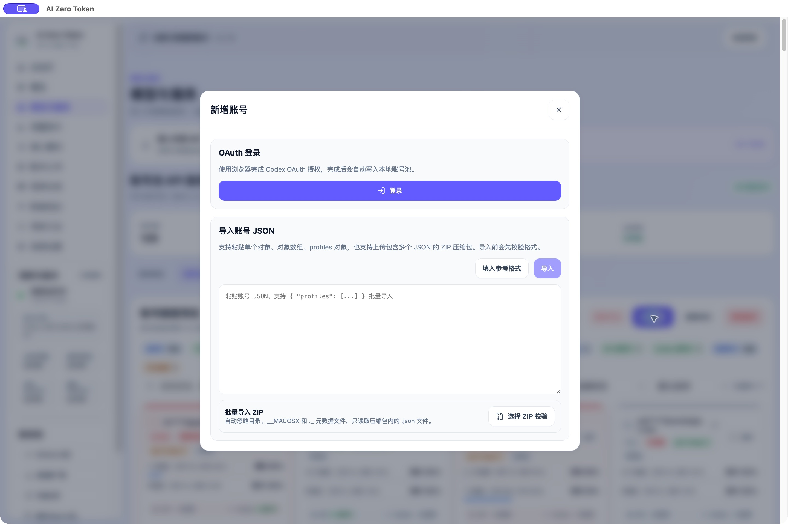

可以选择以下任一方式：

1. **OAuth 登录：** 点击“登录”，在浏览器完成 Codex OAuth 授权，保持客户端打开并等待账号写入账号池。如果 3 分钟内没有收到自动回调，把浏览器地址栏中的完整回调 URL 或 authorization code 粘贴回客户端后提交。
2. **导入 JSON：** 粘贴单个对象、对象数组或 `{ "profiles": [...] }`，然后点击“导入”。不确定格式时先点“填入参考格式”。
3. **导入 ZIP：** 点击“选择 ZIP 校验”。程序会忽略目录、`__MACOSX` 和 `._` 元数据文件，只读取压缩包内的 `.json`；校验通过后再导入。

> 导出的账号 JSON 含完整认证凭据，应当按密码文件管理，不要发送给不可信的人或服务。

**成功标志：** 新账号卡片出现在账号池，卡片能显示套餐、认证状态和额度信息。

### 1.2 获取 API 地址、密钥与调用示例

进入 `模型与服务 → 对外提供 API → 服务概览`。这里集中提供本机调用、局域网调用、调用示例和 API 访问密钥。

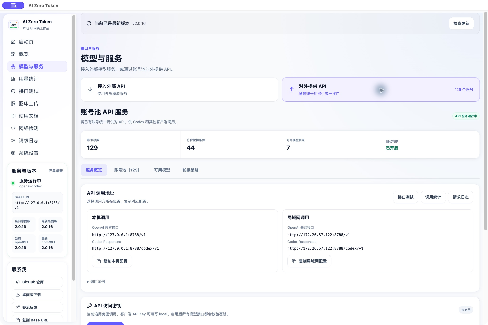

本机通常会显示两类地址：

```text
OpenAI 兼容接口：http://127.0.0.1:8787/v1
Codex Responses：http://127.0.0.1:8787/codex/v1
API Key：local
```

端口被占用时程序会使用其他端口，请直接复制自己客户端中的值。调用方运行在同一台电脑时用“本机调用”；运行在同一局域网的另一台设备时用“局域网调用”。

默认未启用密钥校验，第三方客户端强制要求 API Key 时可以填 `local`。需要限制访问时，在“API 访问密钥”区域生成或填写密钥并保存；启用后，模型接口都必须携带正确的 `Authorization: Bearer <密钥>`。不要把真实密钥写进公开文档或截图。

查看模型列表：

```bash
curl http://127.0.0.1:8787/v1/models \
  -H 'Authorization: Bearer local'
```

发起一次 Chat Completions 请求：

```bash
curl http://127.0.0.1:8787/v1/chat/completions \
  -H 'Content-Type: application/json' \
  -H 'Authorization: Bearer local' \
  -d '{
    "model": "替换为可用模型页中的模型 ID",
    "messages": [{"role": "user", "content": "请只回复 OK"}]
  }'
```

**成功标志：** HTTP 状态码为 `200`；模型列表返回 `data`，对话请求返回模型响应。

### 1.3 选择对外提供的模型

进入“可用模型”，确认当前账号池公开哪些模型。调用 API 时，`model` 必须使用这里实际显示的模型 ID。

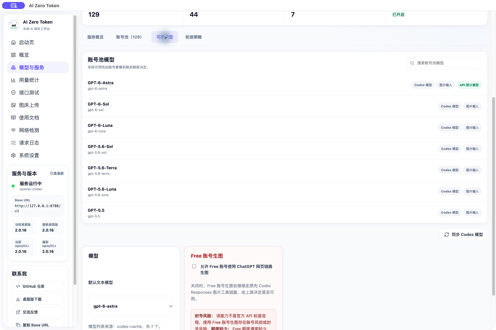

如果某个账号当前不可用、额度耗尽或被手动排除，它不会被自动轮换选中，即使模型仍显示在目录里。

### 1.4 接入 Codex

进入“接入 Codex”，选择要在 Codex 中使用的模型并保存。该操作会更新 Codex 配置；保存后应完全退出并重新打开 Codex，让它重新读取配置。

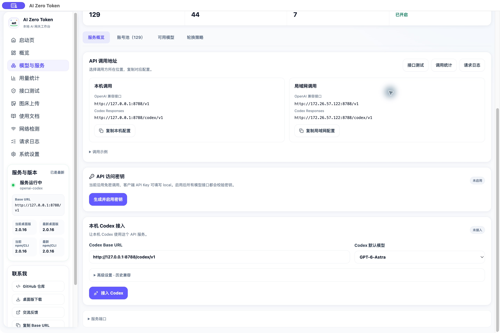

**成功标志：** 页面显示已接入，重启 Codex 后能看到所选模型并完成请求。

需要解除时，返回“模型与服务”，在页面顶部“当前接入 Codex”区域直接点击“解除接入”。解除只影响 Codex，账号池 API 服务会继续运行。

### 1.5 接入 OpenClaw 或其他客户端

任何支持 OpenAI 兼容接口的客户端，通常只需要三项：

| 配置项 | 填写内容 |
| --- | --- |
| Base URL | 客户端“服务概览”中显示的 OpenAI 兼容地址 |
| API Key | 未启用校验时填 `local`；启用后填实际访问密钥 |
| Model | “可用模型”页中显示的模型 ID |

OpenClaw 的现成模板可在左侧“使用文档”中打开“OpenClaw”标签后复制。其他客户端如果会自动拼接 `/v1`，注意不要重复写成 `/v1/v1`。

### 1.6 配置轮换策略

进入“轮换策略”可启用自动切换、调整刷新并发与请求间隔，并手动排除不参与轮换的账号。

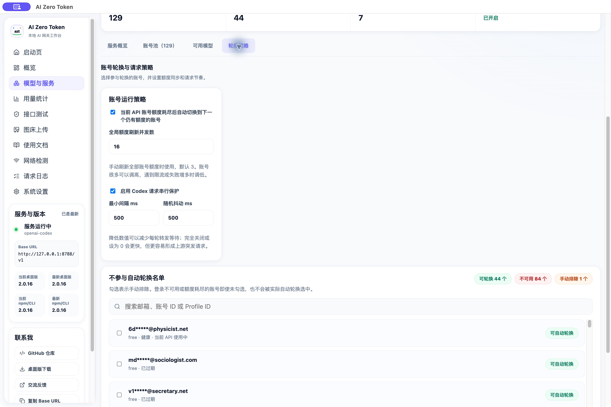

- 自动切换只会使用当前可登录、额度可用且未被手动排除的账号；
- 降低请求间隔可以减少等待，但更容易形成上游突发请求；
- 修改服务端口或关键网关设置后，按页面提示重启网关。

### 1.7 常见问题

- **返回 401：** 启用了访问密钥但客户端仍填 `local`，或请求没有 Bearer 头。
- **返回 model not found：** `model` 不是“可用模型”中当前存在的 ID。
- **局域网设备无法连接：** 检查监听地址、防火墙和“局域网调用”中的地址；不要把网关直接暴露到不可信网络。
- **Codex 保存后没变化：** 完全退出并重新打开 Codex。

## 2. 接入外部 API

### 功能用途与适用场景

“接入外部 API”用于保存第三方或自建 OpenAI 兼容服务，并把其中选定的模型写入本机 Codex。适合 OneAPI、OpenRouter、公司内部网关以及其他能提供兼容模型接口的服务。

> 外部 API 会直接消耗该服务 Token 对应的额度，不会经过 AI Zero Token 账号池轮换。

### 2.1 添加服务

进入 `模型与服务 → 接入外部 API`，点击“添加外部 API”。

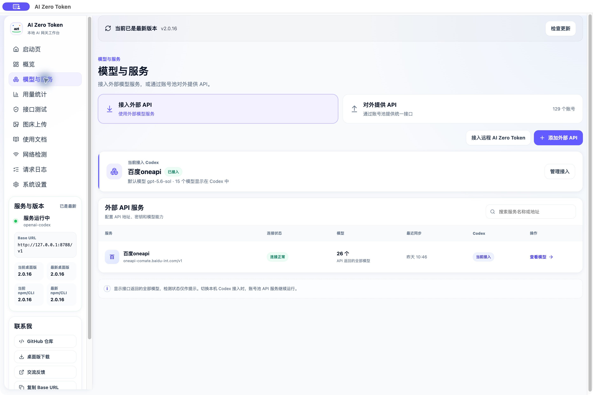

填写：

- **服务名称：** 便于自己识别，例如“公司 OneAPI”；
- **API Base URL：** 上游提供的 OpenAI 兼容地址，通常以 `/v1` 结尾；
- **API Token：** 上游分配的 Token，仅保存到本机；
- **模型获取方式：** 优先选择“自动获取模型列表”。如果服务不提供模型列表接口，再选择“手动填写模型 ID”。

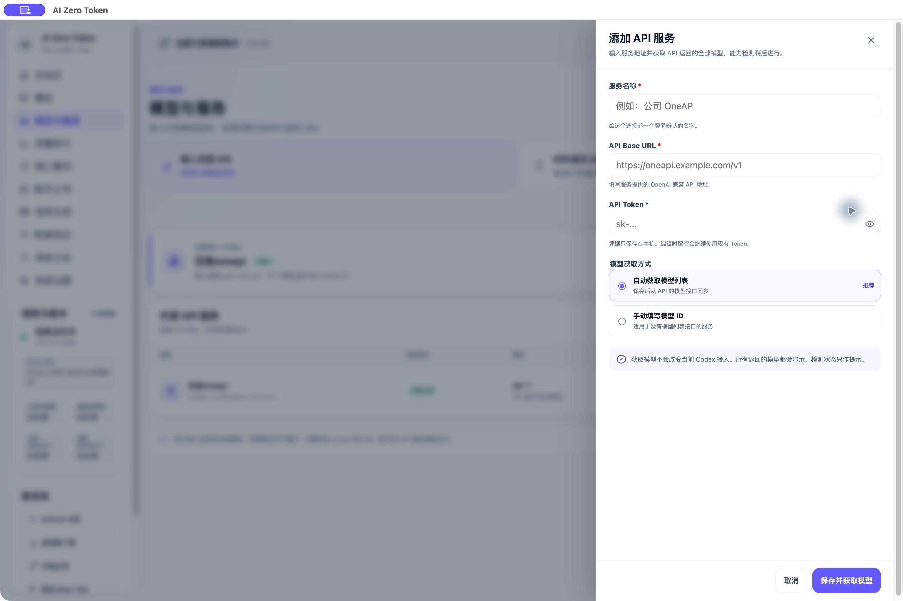

手动模式下逐行或按界面提示填写真实模型 ID：

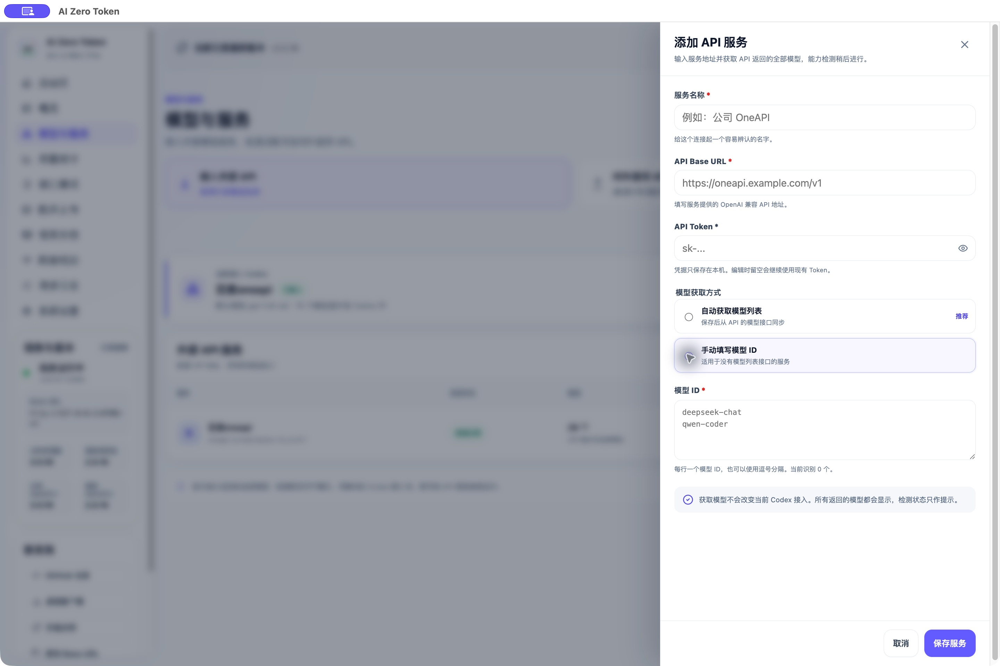

点击“保存并获取模型”只保存服务并同步模型，不会自动改变当前 Codex 接入。

### 2.2 同步并检查模型

打开服务详情，点击同步模型。需要判断 Chat、Responses、图片或其他能力时，可对单个模型点“检测能力/重新验证”，也可验证当前筛选结果；一次最多验证 20 个模型。

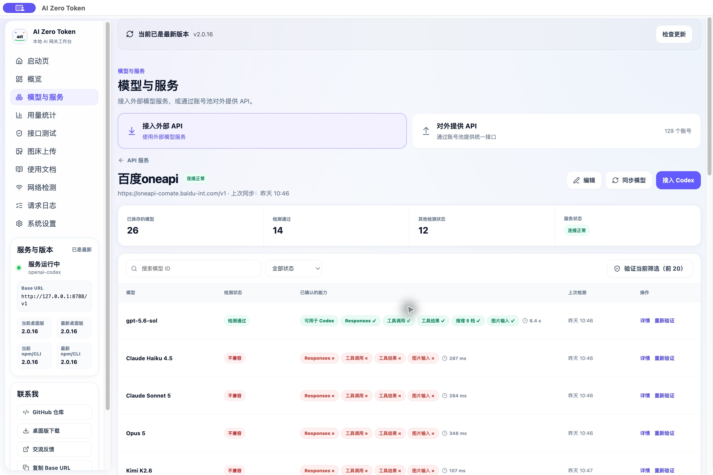

> 能力检测会向上游发送真实请求并消耗额度。检测状态只是提示：未检测、服务繁忙或本次检测失败的模型仍可勾选，最终兼容性以真实调用为准。

### 2.3 接入 Codex

1. 在服务卡片或详情页点击“接入 Codex”。
2. 勾选要显示在 Codex 模型选择器中的模型。
3. 选择一个默认模型。
4. 点击“保存并重启 Codex”。

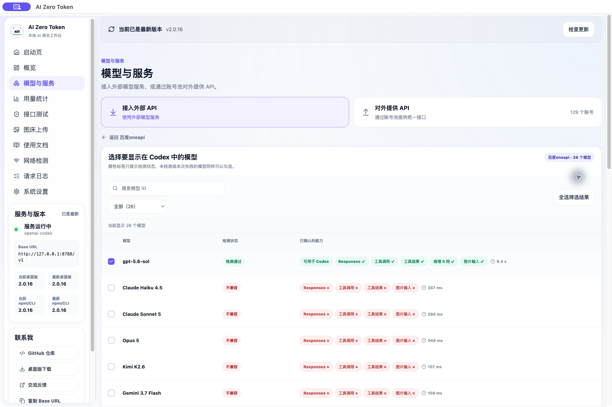

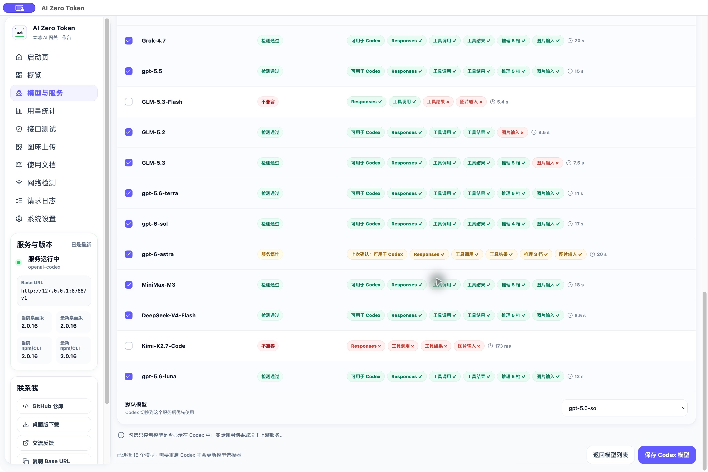

**成功标志：** 服务显示已接入，重启后的 Codex 能看到所选模型并完成请求。

### 2.4 解除接入

进入 `模型与服务 → 接入外部 API`，在页面顶部“当前接入 Codex”区域直接点击“解除接入”。也可以进入“管理接入”，使用页面底部的同名按钮。请先等待当前回复完成；macOS 桌面版会尝试正常退出并重新打开 Codex，CLI/IDE 和其他平台需先完全退出相关 Codex 进程。

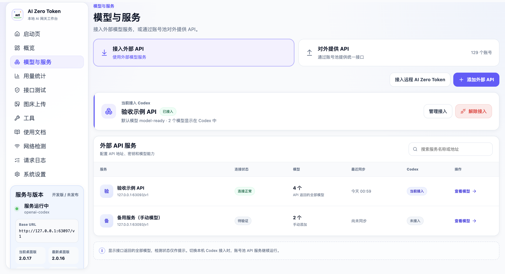

解除接入只取消这个服务对 Codex 的接管，外部 API 服务、Token、模型检测记录和已选模型都会保留，之后可以直接再次接入。它不会停止账号池对外提供 API，也不会删除外部服务。

第三方共用固定的 `azt_active` provider，原生模式使用 `openai`。接入时同步当前 Codex 数据目录中已有会话的 provider 和模型，所以新旧本地对话都使用当前服务。解除时统一回到原生 Codex 服务，不恢复此前的其他第三方。AZT 不手工改写会话 JSONL，也不替换原生登录；Codex 后续会自行记录新的会话设置。

第三方请求直接从 Codex 发往对应服务。活动 Key 同时存在 AZT 的服务记录和 Codex 配置中；解除后移除固定活动配置中的 Key，保留 AZT 服务资料和兼容 provider 定义，避免旧历史元数据中的名称变成缺失引用。删除未接管的服务不会影响当前服务的固定入口。

切换前会备份配置与 SQLite 数据库。失败时尝试恢复；若中断后又产生新消息或配置修改，会停止自动回滚并保留备份。再次接管或解除时先处理未完成的切换。备份位于 `~/.ai-zero-token/.state/codex-switch-backups/`，其中可能包含凭证和会话数据库，请勿公开上传。

**成功标志：** 页面不再显示该服务为“当前接入”，服务和模型记录仍保留在外部 API 列表中。

必须知道的规则：

- 同一时间只能接入一个模型服务；接入另一个服务会替换当前 Codex 的模型服务配置。
- 会话原模型在新服务中可用时保留，否则改用新服务的默认模型。解除时优先恢复原生模型偏好。
- 启用中的 Codex profile 或项目配置如果覆盖了连接/模型，会阻止统一切换；需先处理这些覆盖。
- 从统一第三方接管切到旧账号池入口前，先解除第三方接管，防止只改默认配置而遗漏已有会话。
- 切换 Codex 到外部服务不会停止账号池对外提供 API，其他客户端仍可调用本地账号池。
- 编辑已接入服务的地址、Token 或模型后，需要重新保存 Codex 接入配置。
- API Token 属于敏感凭据，不要出现在截图、日志、Issue 或聊天记录中。

## 3. 图床上传

### 功能用途与适用场景

“图床上传”把本地图片批量上传到当前 GitHub 账号的公开仓库，并返回可直接使用的公网原图链接。适合为 Markdown、Issue、说明文档或图片接口准备可访问 URL；不适合上传隐私图片、密钥截图或不应公开的资料。

### 3.1 准备 GitHub 仓库和 Token

首次使用前需要在 GitHub 完成两项准备：

1. 创建名为 `azt-img-bed` 的**公开仓库**。当前版本的仓库名固定，图片会写入 `images/` 目录。
2. 创建 GitHub Personal Access Token，并在 Repository access 中包含 `azt-img-bed`。具体权限与创建步骤可展开页面底部“GitHub token 创建说明”查看。

进入左侧“图床上传”，在 Token 区填写 Token 并保存。程序会验证当前 GitHub 用户、仓库和默认分支。Token 只应保存在自己的电脑，不要粘贴到文档或发给他人。

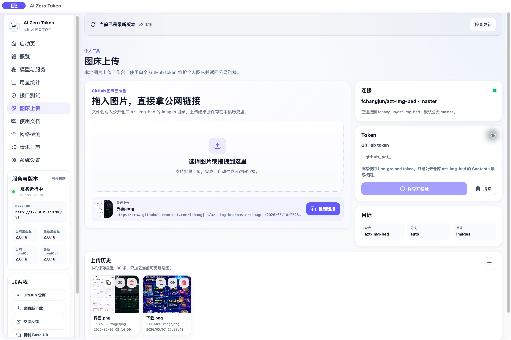

### 3.2 上传并复制链接

连接成功后，把一张或多张图片拖入上传区，或点击“选择图片”。上传完成后，页面会显示“复制链接”，并把记录加入本机上传历史。

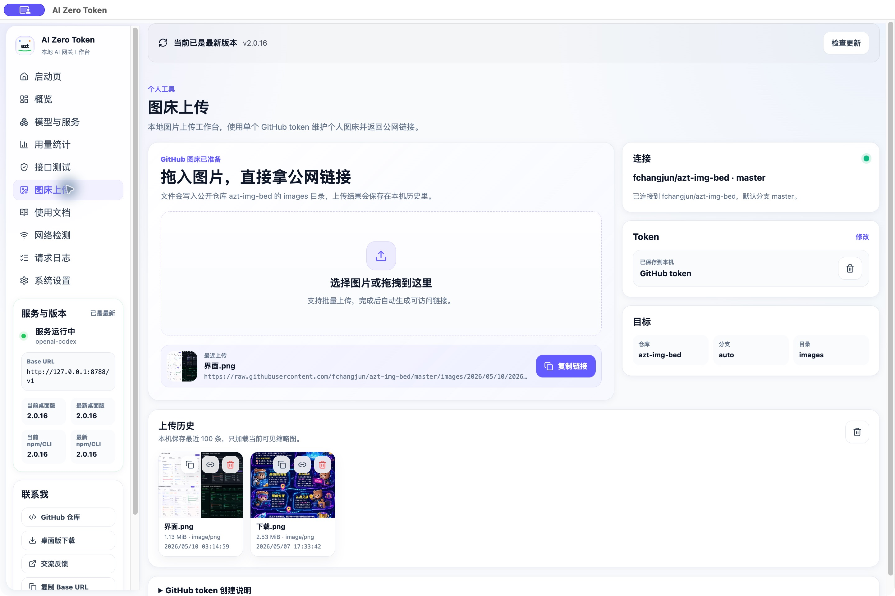

**成功标志：** 右侧连接状态为绿色，显示 `GitHub 用户名/azt-img-bed · 默认分支`；上传结果出现缩略图和 `raw.githubusercontent.com` 链接。

### 3.3 管理历史与远端文件

上传历史最多在本机保存最近 100 条。每个历史卡片可以复制链接、打开 GitHub 页面或删除：

- 删除**单条上传记录**会同时删除 GitHub 仓库中的对应远端文件；
- “清空历史”只清除本机历史，不会删除 GitHub 上的图片；
- 清除 Token 会移除本机保存的图床凭据，不会删除仓库或已经上传的图片。

### 3.4 常见问题

- **验证失败：** 确认仓库名严格为 `azt-img-bed`、仓库是公开的、Token 能访问该仓库。
- **链接暂时打不开：** GitHub 原图链接可能有短暂缓存延迟，稍后再试。
- **图片不应公开：** 不要上传。该功能使用公开仓库，获得链接的人可能访问图片。

## 4. 接口测试

### 功能用途与适用场景

“接口测试”是在客户端内验证当前账号池 API 的工作台，适合首次接入、排查请求体、确认模型能力，或在配置第三方客户端之前先做最小验证。

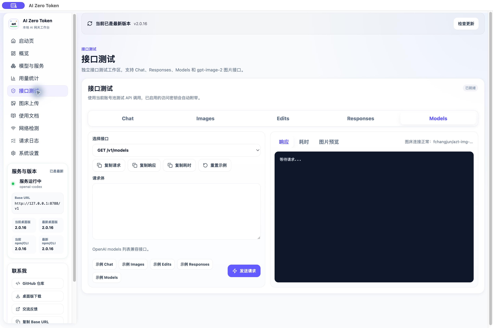

### 操作方法

1. 在顶部选择 `Chat`、`Images`、`Edits`、`Responses` 或 `Models`。
2. 在“选择接口”中确认具体路径；页面会自动生成示例请求体。
3. 修改模型 ID、提示词或图片参数。图片编辑可选择 Base64，也可以在图床已配置时上传并写入公网链接。
4. 点击“发送请求”，在右侧查看响应、耗时和图片预览。

**成功标志：** 右侧“响应”出现成功 JSON；图片请求还会在“图片预览”中显示结果。

> 除读取 Models 外，测试通常会向上游发送真实请求并消耗账号或外部服务额度。图片生成和编辑尤其可能产生费用，不要为了试界面反复发送。

## 5. 用量统计

### 功能用途与适用场景

“用量统计”汇总真实网关请求，适合观察账号和模型使用量、估算费用、失败率、响应耗时以及图片调用情况。

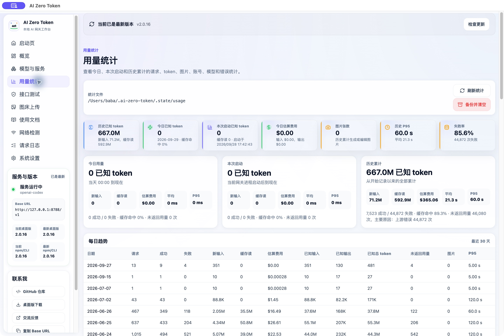

页面显示今日、本次启动和历史累计的已知 token、新输入、缓存读、估算费用、图片数、成功/失败、平均耗时和 P95，并按日期、账号、模型、接口、用量捕获状态、错误、生图链路和来源汇总。

点击“刷新统计”读取最新结果。“备份并清空”会先备份当前统计目录，再从 0 重新统计。

**成功标志：** 新请求完成后刷新页面，相应时间段和维度的请求数发生变化。

> 统计不保存提示词、消息内容、Token 或 base64 图片。费用是根据已知用量计算的估算值，不等同于上游账单；部分上游不返回 usage 时会计入“未返回用量”。

## 6. 请求日志

### 功能用途与适用场景

“请求日志”用于按时间、方法、来源和状态查看网关最近收到的 API 请求，适合排查 401、404、模型不兼容、上游错误和响应过慢。

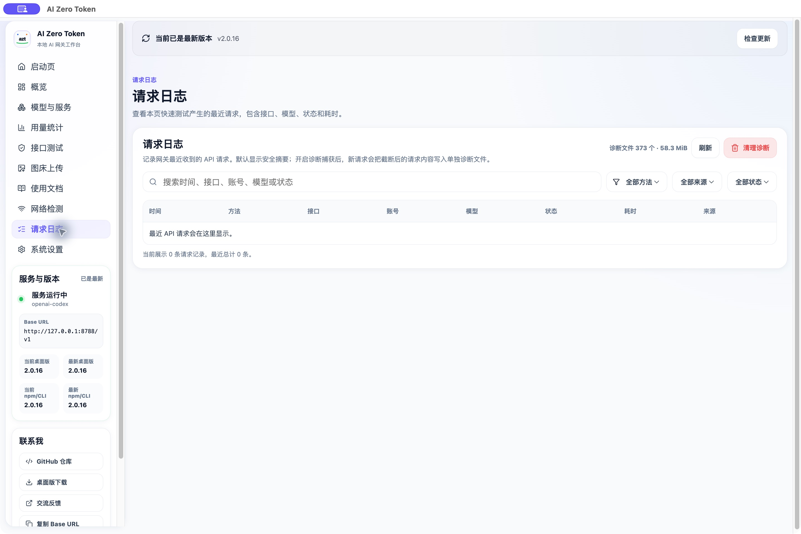

使用搜索框按时间、接口、账号、模型或状态搜索，也可以用“全部方法”“全部来源”“全部状态”筛选。普通日志记录状态码、耗时、账号、模型、接口和安全摘要，不保存完整提示词。

系统设置中可以开启“将 Codex 请求内容写入独立诊断文件”；之后的新请求会保存截断后的上下文摘要，必要时还可开启完整返回 SSE 协议。回到请求日志后可以查看引用或清理诊断文件。

**成功标志：** 发出请求并刷新后，表格中出现对应时间、接口、状态和耗时。

> 诊断文件可能包含请求上下文；只在排障期间开启，完成后及时关闭并清理。清理诊断不会删除普通请求日志和用量统计。

## 7. 网络检测

### 功能用途与适用场景

“网络检测”用于判断当前机器访问海外上游的基础网络环境，适合排查 OAuth 页面打不开、接口超时、代理未生效或 WebRTC/DNS 泄漏。

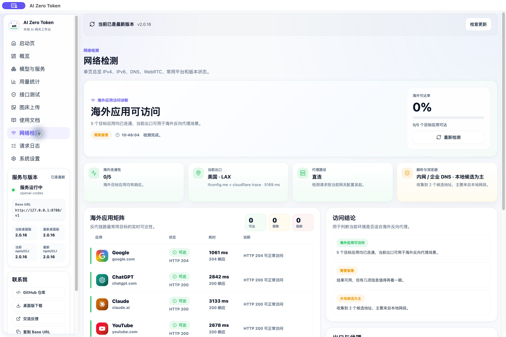

打开页面会自动检测，也可以点击“重新检测”。结果包括公网 IPv4/IPv6、出口位置、系统 DNS、当前代理、WebRTC 候选，以及 ChatGPT、Claude、Google、YouTube 和 X 的连通性。

**成功标志：** 检测结束后各卡片从“待检测”变为明确结果，并给出海外应用可达率和访问结论。

> 结果只代表当前网络环境，不代表账号拥有调用权限。平台“可达”也不等于所有 API 或 OAuth 流程都一定成功。

## 8. 客户端内置使用文档

### 功能用途与适用场景

“使用文档”根据当前运行端口动态生成接入参数，适合复制 Base URL、API Key、OpenClaw 模板、Skill.md 和示例代码，不必手工替换截图中的地址。

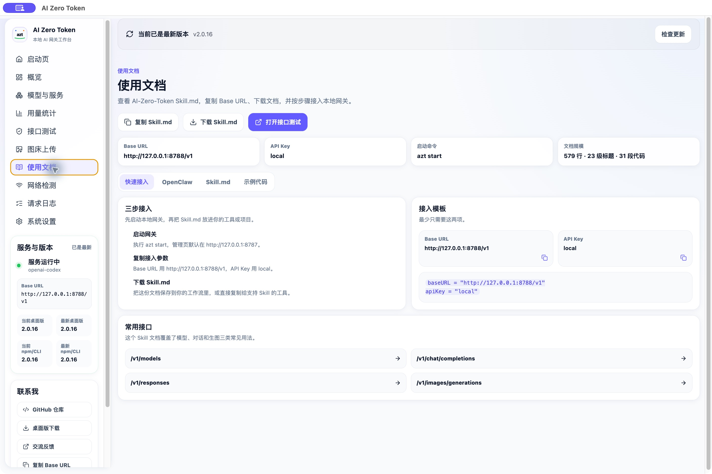

打开 `快速接入`、`OpenClaw`、`Skill.md` 或 `示例代码` 标签，按需复制内容；也可以下载 Skill.md，放入支持 Skill 的工具或项目。

**成功标志：** 复制的 Base URL 与客户端左侧当前 Base URL 一致，调用后返回成功响应。

## 9. 系统设置

### 功能用途与适用场景

“系统设置”集中管理影响整个客户端的网络代理、诊断记录和显示偏好。适合代理环境、流式协议排障，以及需要隐藏邮箱的场景。

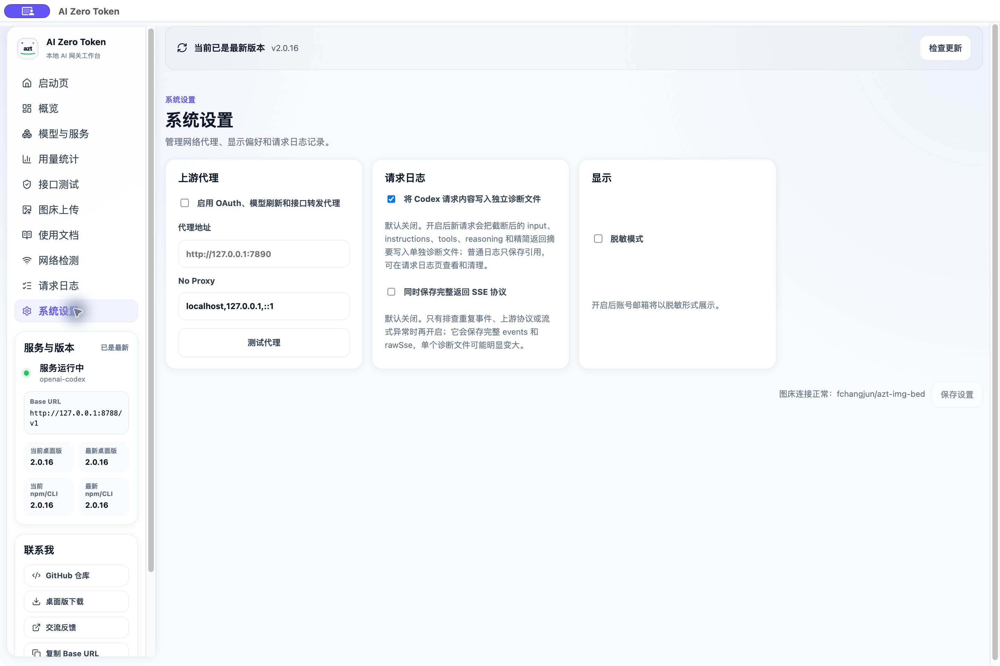

- **上游代理：** 为 OAuth、模型刷新和接口转发启用代理；填写地址与 No Proxy 后先点“测试代理”。
- **请求日志：** 开启 Codex 请求内容诊断；只有排查重复事件、协议或流式异常时再同时保存完整 SSE。
- **显示：** 开启“脱敏模式”后，账号邮箱会以脱敏形式显示。

修改后点击“保存设置”。

**成功标志：** 页面提示保存成功；代理测试返回可用，或界面中的邮箱按设置脱敏。

> 代理地址错误可能导致 OAuth、模型刷新和接口转发失败。完整诊断内容可能包含请求上下文，请仅在排障期间开启并妥善保管。

## 10. Response Reviewer

进入左侧“工具”，可以启用本地 Response Reviewer，对具体回复添加批注并汇总修改意见。服务默认关闭，不参与模型请求转发。

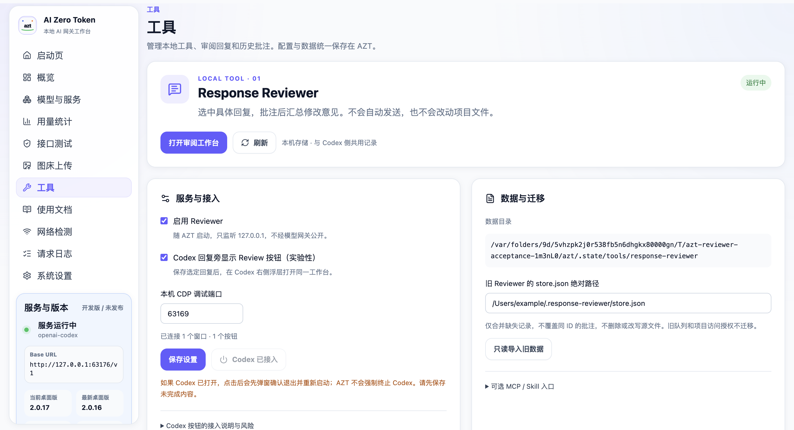

1. 勾选“启用 Reviewer”，点击“保存设置”。
2. 点击“打开审阅工作台”，或从“审阅历史”打开已有记录。
3. 如需在 Codex 回复旁显示 Review 按钮，另行勾选实验性开关并点击“保存并启动 Codex 接入”。如果 Codex 正在运行，会先请求你确认正常退出并重启；请提前保存未完成内容。
4. 在选定回复上添加文字批注或整体意见，使用“复制指令”汇总后自行发送。“放入对话框”只尝试预填，仍需自己确认发送。

Reviewer 不自动发送消息，也不自动改写项目文件。读取关联文件前必须确认项目目录。Codex 按钮依赖页面结构及本机调试连接，并非官方原生面板；若接入不兼容，可回到 AZT 工作台查看相同记录。不要公开或转发调试端口、含访问令牌的工作台链接。

关闭服务不会删除审阅记录。在“数据与迁移”填写旧 `store.json` 的绝对路径并点击“只读导入旧数据”，只合并缺失记录，不修改旧文件、不覆盖已有批注，也不继承旧的文件访问授权。详细步骤见 [Reviewer 使用与迁移说明](REVIEWER_MIGRATION.md)。

## 桌面端和网页管理页有什么差异

桌面客户端和 CLI 打开的网页管理页使用同一套管理界面，所以账号池、外部 API、模型、轮换、图床、日志、统计和接口测试的字段及操作流程一致。桌面端界面可直接参照本指南中的截图。

桌面端额外提供原生应用窗口和网关生命周期管理、macOS 菜单栏账号面板、桌面应用更新，以及部分流程中的直接重启网关或 Codex。网页管理页没有这些原生能力，但核心功能可以按本文相同路径操作。

## npm / CLI 使用方式

需要 Node.js 22 或更高版本：

```bash
npm install -g ai-zero-token
azt start
```

`azt start` 启动网关并尝试打开管理页；`azt serve` 只启动服务。也可以指定监听地址和端口：

```bash
azt start --host 127.0.0.1 --port 8787
```

桌面端和 CLI 共享同一套本地状态。只允许本机使用时建议监听 `127.0.0.1`。

## 数据、安全与常见问题

### 本地数据保存在哪里

默认状态目录：

```text
~/.ai-zero-token/.state
```

可通过环境变量改变应用目录：

```bash
AI_ZERO_TOKEN_HOME=/path/to/home azt start
```

### 为什么界面中的账号、端口或模型与指南不同

账号状态、端口、服务名、模型和统计数据会随本机配置及运行情况变化。请以客户端当前显示的 Base URL、密钥和模型 ID 为准。

### 端口被占用怎么办

桌面端会显示实际端口。CLI 可以明确指定其他端口：

```bash
azt start --port 8790
```

然后把所有客户端 Base URL 一并改为新端口。
